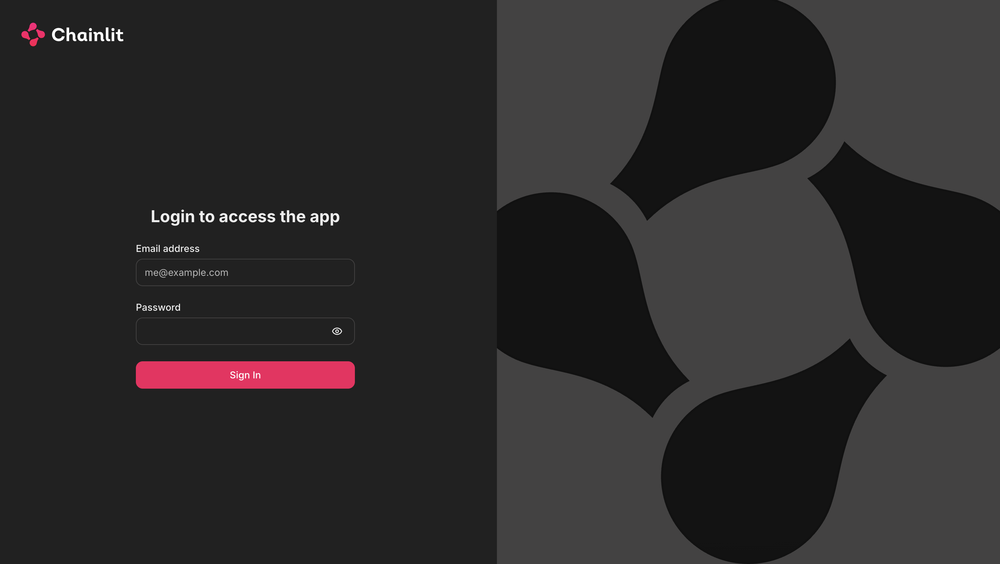
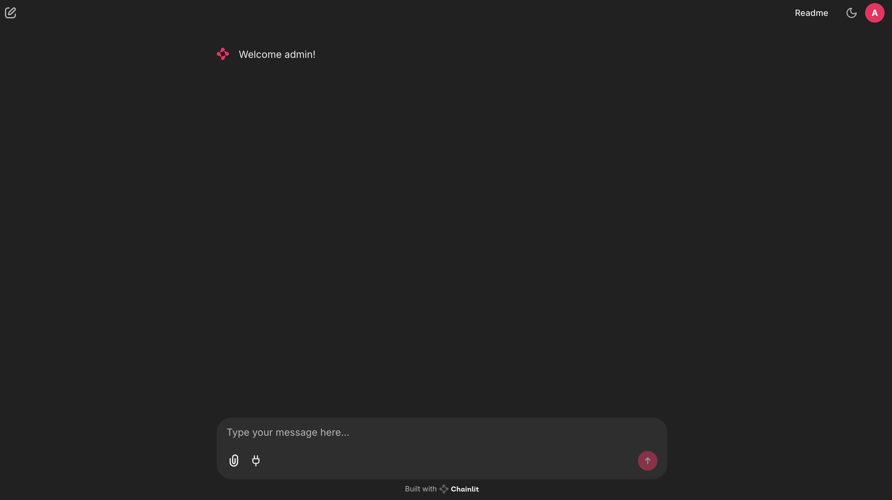
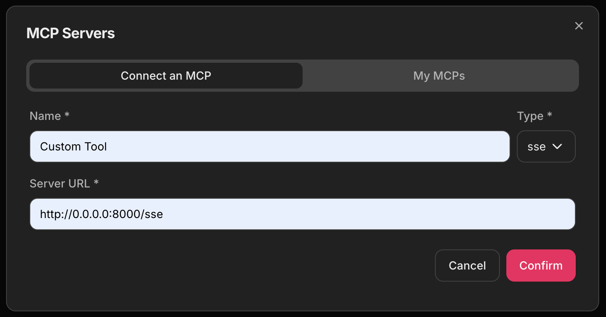
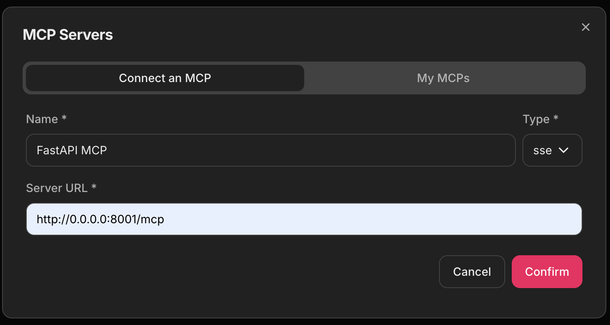
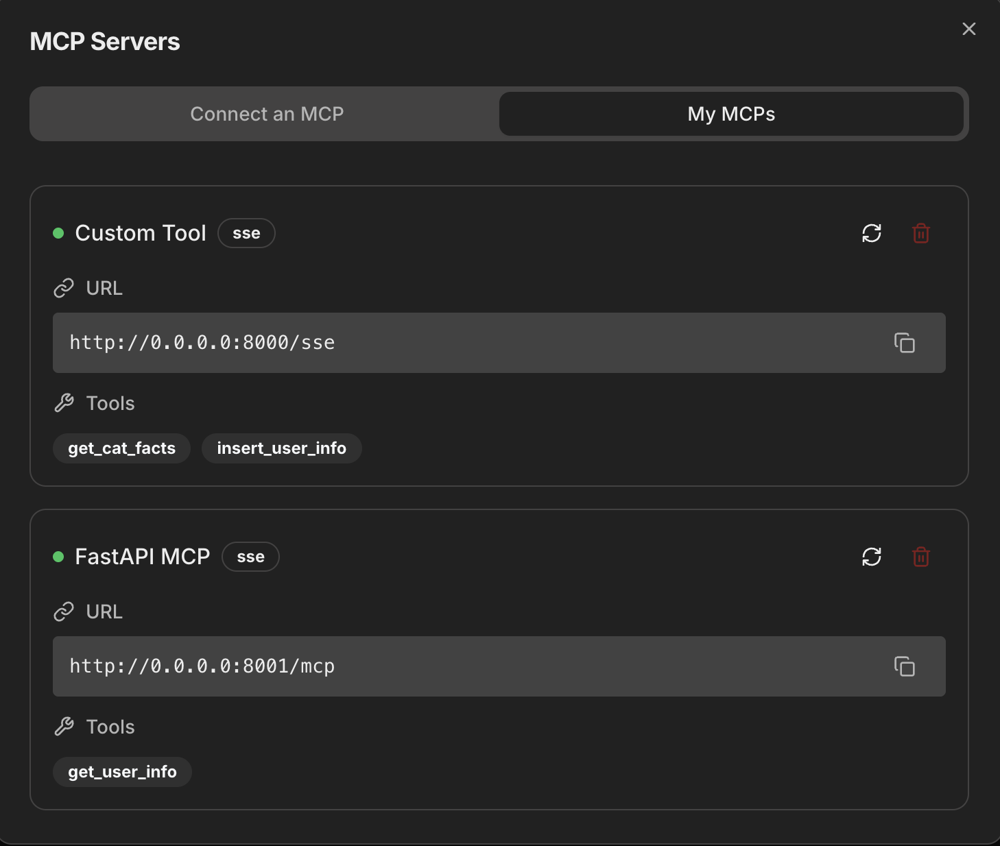
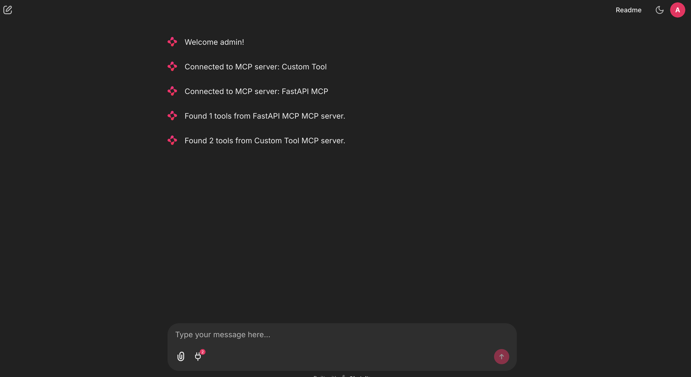
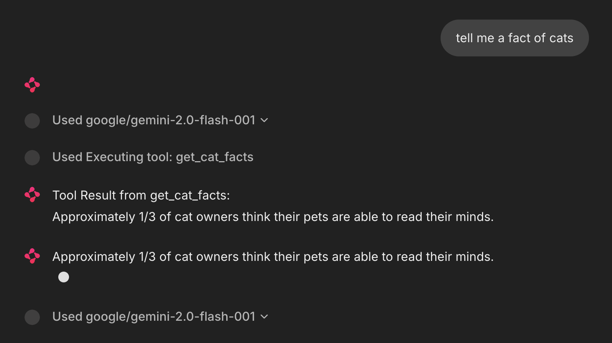
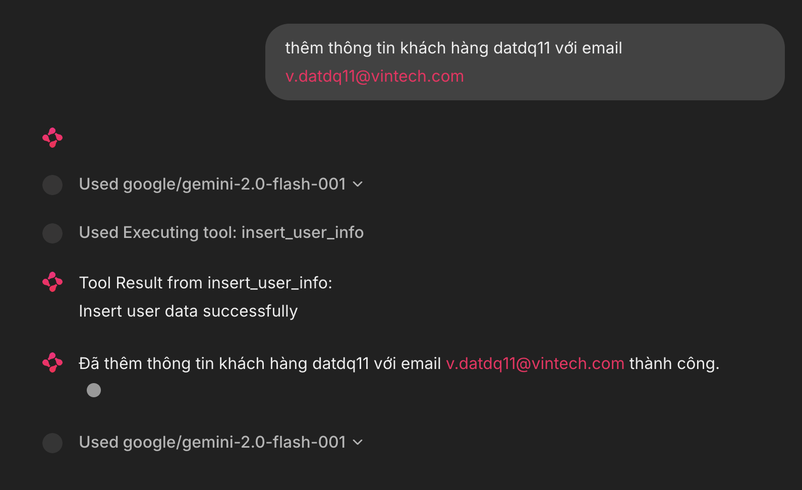

# mcp-chainlit
Simple Application with MCP and Chainlit 


## Step 1 : Setup environment

### Install library

```
pip install -r requirements.txt
```

### Setup PostgreSQL

Create Postgresql database
```
cd mcp_server/setup
docker compose -f docker-compose.yaml up -d
```

Init table
```
python -m resources.database.init
```

### Setup Chainlit

Create Chainlit secret key

```
chainlit create-secret
```

Add to .env file

```
export CHAINLIT_AUTH_SECRET="your-secret-key"
```

### Setup LLM 
Get your own API key at : https://openrouter.ai/

## Step 2 : Setup workflow

### Setup FastAPIMCP

```
uvicorn mcp_api.app:app --host 0.0.0.0 --port 8001
```

## Setup MCP Server

```
mcp run server.py --transport sse
```

## Step 3 : Setup UI Chainlit

```
chainlit run ui.py --port 8090
```

After that, one window will exposes in http://0.0.0.0:8090

## Step 4 : Integrate MCP tools in Chainlit

### Verify MCP connection
Please check http://0.0.0.0:8000/sse and http://0.0.0.0:8001/mcp
It will be output like that 

```
event: endpoint
data: /messages/?session_id=ae8581d368cd4b538e0c207a4246edb1
```

### Play with Chainlit

#### 1. Login


Username : *admin*

Password: *admin*

#### 2. Plugin MCP Tool

Welcome Page



Config MCP Custom Tool



Config MCP FastAPI



Plugin Result



Chainlit Plugin Success



#### 3. Test Result

Get Cat Facts



Insert PostgreSQL



Result


